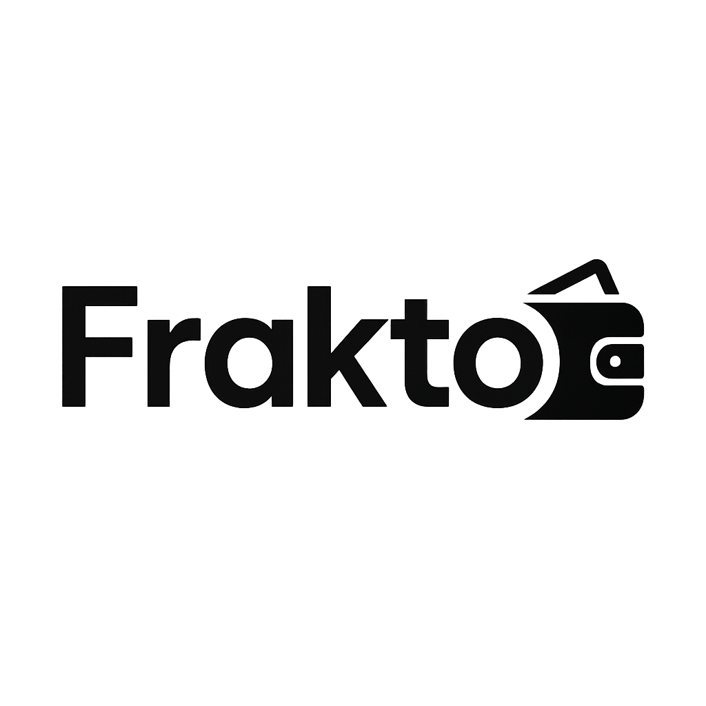

# Frakto

<p align="center">
	
</p>

<p align="center">
	
	
	
	
	
</p>

**Presentación**

Frakto es mucho más que un repositorio: es una propuesta pensada para personas y pequeñas empresas que quieren recuperar el control de sus finanzas de forma clara, elegante y accesible. Imagina una herramienta que organiza tus movimientos, te muestra tus patrones de gasto y te da la confianza para tomar mejores decisiones económicas —sin tecnicismos, sin complicaciones.

En una interfaz cuidada y con funciones diseñadas para ayudar a ahorrar tiempo, Frakto convierte datos financieros en información práctica. Perfecto para quienes quieren una visión rápida y útil de su economía personal o para profesionales que necesitan presentar informes claros y visuales a sus clientes.

**Por qué te interesa**

- Visualiza tus finanzas de manera atractiva y directa.
- Genera informes y resúmenes listos para compartir.
- Ahorra tiempo en tareas repetitivas como conciliaciones o resúmenes mensuales.
- Diseño pensado para que cualquier persona, aunque no sea experta, entienda su situación económica.

**Beneficios rápidos**

- Ahorro de tiempo: automatiza la generación de reportes.
- Decisiones mejor informadas: visualizaciones que destacan lo importante.
- Profesionalismo: exporta resúmenes y PDFs para presentaciones o auditorías.

**¿A quién va dirigido?**

- Autónomos y profesionales independientes.
- Propietarios de pequeños negocios.
- Personas que quieren mejorar su gestión financiera sin complicarse.

**Prueba y contribuye**

Si te convence la idea, prueba el proyecto, contribuye con mejoras o adapta Frakto a tus necesidades: este repositorio está pensado para crecer con la comunidad.

---

## Contenido técnico (preservado)

This project was created with [Next.js](https://nextjs.org) using [`create-next-app`](https://nextjs.org/docs/app/api-reference/cli/create-next-app).

## Inicio rápido

Primero, ejecuta el servidor de desarrollo:

```bash
npm run dev
# o
yarn dev
# o
pnpm dev
# o
bun dev
```

Abre [http://localhost:3000](http://localhost:3000) en tu navegador para ver la aplicación.

Puedes empezar a editar la página modificando `app/page.tsx`. La página se actualizará automáticamente mientras la editas.

Este proyecto utiliza [`next/font`](https://nextjs.org/docs/app/building-your-application/optimizing/fonts) para optimizar y cargar automáticamente la familia de fuentes [Geist](https://vercel.com/font).

## Más información

Para saber más sobre Next.js, consulta los siguientes recursos:

- [Documentación de Next.js](https://nextjs.org/docs) - aprende sobre las características y la API.
- [Learn Next.js](https://nextjs.org/learn) - tutorial interactivo.

También puedes consultar el [repositorio de Next.js en GitHub](https://github.com/vercel/next.js) — tus comentarios y contribuciones son bienvenidos.

## Despliegue en Vercel

La forma más sencilla de desplegar tu aplicación Next.js es usar la plataforma [Vercel](https://vercel.com/new?utm_medium=default-template&filter=next.js&utm_source=create-next-app&utm_campaign=create-next-app-readme).

Consulta la [documentación de despliegue de Next.js](https://nextjs.org/docs/app/building-your-application/deploying) para más detalles.
